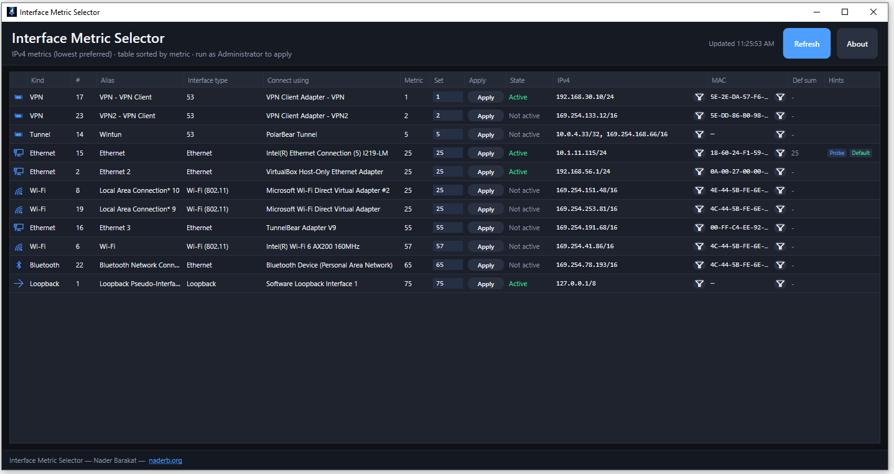

# Interface Metric Selector

Source code for **Interface Metric Selector** — a **Windows 10 / 11 WPF** desktop app to **view and change IPv4 interface metrics** (routing preference), see adapter details, and copy IP/MAC — without juggling `netsh` or WMI **by hand**.

This repository holds the **application source** (`InterfaceMetricSelector/` plus `docs/` and license files).



## Download

Installers or portable builds: **[www.naderb.org](https://www.naderb.org/)**

## Features

- Lists IPv4 interfaces sorted by metric (lower = preferred).
- Edit metric and **Apply** (requires **Run as administrator**).
- Shows **interface type**, **Connect using** (driver name from Windows), state, IPv4, MAC, and default-route hints.

## Build from source (optional)

You need the [.NET 6 SDK](https://dotnet.microsoft.com/download/dotnet/6.0) and Windows (WPF). From this repo root:

```
cd InterfaceMetricSelector
dotnet publish -c Release -r win-x64 --self-contained true -o ./publish-portable
```

This produces a self-contained **win-x64** output folder (includes `InterfaceMetricSelector.exe`; no separate .NET runtime on the target PC).

## Contributing

- **Nader Barakat**
- **Andreas Karamanous**

## License

[MIT License](LICENSE) — free to use and share; keep the copyright notice when you redistribute.

---

**Website:** [www.naderb.org](https://www.naderb.org/)
